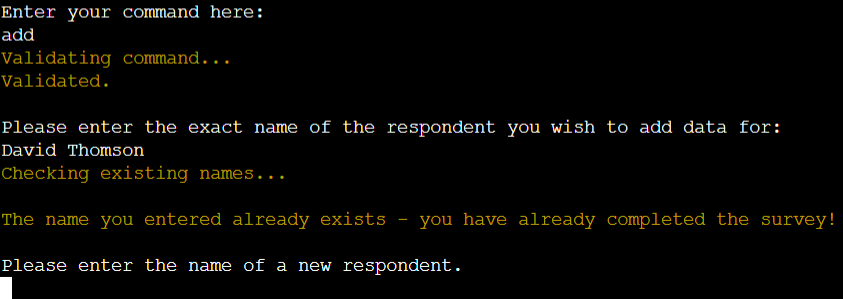
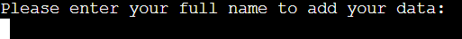
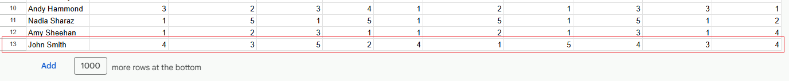
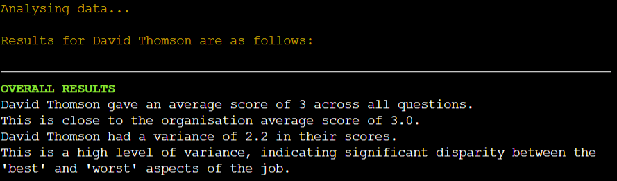
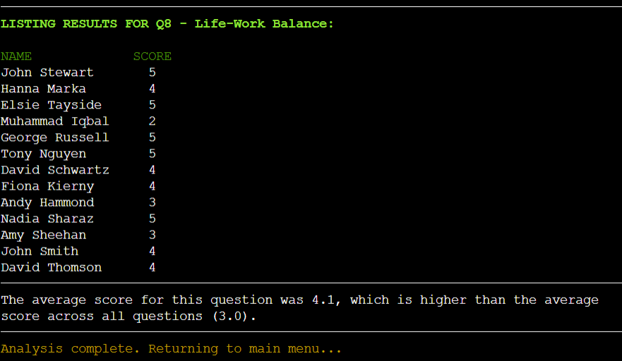
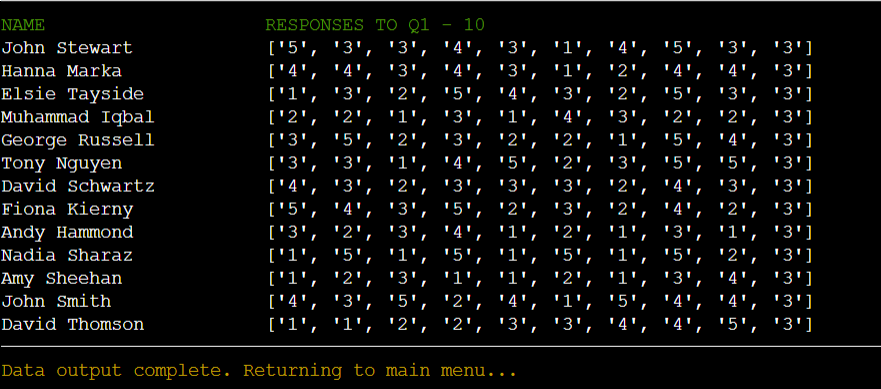
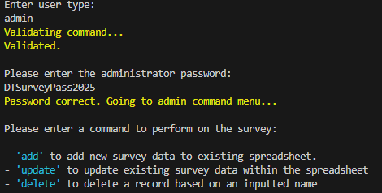
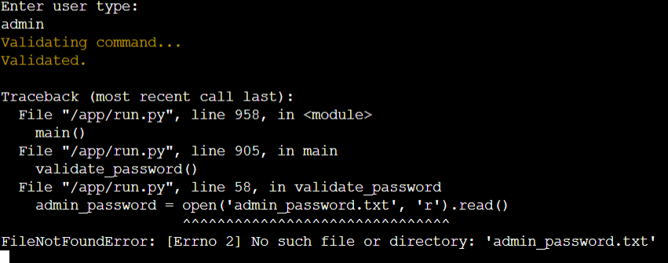
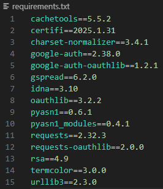
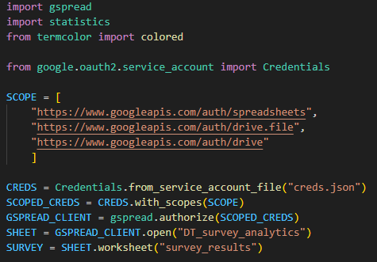

# DT Survey Analytics - A staff survey management application
'DT Survey Analytics' is a Command-Line Interface (CLI) survey management system hosted as an application on Heroku and written using Python. 

## Link to application
The application can be accessed directly at this dedicated link: https://dt-survey-analytics-703eb2156e77.herokuapp.com/

## Project Purpose
The purpose of the application is to provide users with a way to conduct and manage results for a simple staff survey for their organisation. The app will allow users, who may be either staff respondents to the survey or administrators conducting analysis, to conduct functions on the current survey dataset based on various commands (e.g. "add", "read", "analyse"), with differential permissions depending on access level. In addition to reading raw data, administrators will also be able to conduct analysis over the dataset in order to identify key areas of improvement for the organisation based on low-scoring metrics in the survey.

## Project Planning

### User Stories
As an administrator, I want to...
- ...be able to restrict respondents access to the application so that they can add, update and delete their data, but not have access to other functions
- ...be able to add responses on behalf of employees as there may be cases in which employees cannot update themselves 
- ...be able to update an employee's responses in case they wish to make changes after initial completion
- ...be able to delete an employee's responses in case their data is no longer mean to be counted for any reason (e.g. left organisation, GDPR request)
- ...see a list of all respondents so I know who has/has not completed the survey, and which names can be used to retrieve data
- ...be able to read and analyse an employee's responses to each question to inform me on their experience with different metrics relevant to the running of the organisation
- ...be able to add new questions to the survey, as we may look to extend the survey to include additional questions
- ...be able to read and analyse data for a specific question, to get a wide view of how employees view performance on this metric across the organisation
- ...be able to delete questions so that we have full control over the survey content and can delete any questions from the default survey sheet which are not relevant to our organisation
- ...be able to read a summary of all data from the spreadsheet to have an "at a glance" version without needing to refer to external resources
- ...be able to conduct analysis over the whole survey data, getting averages for each question and identifying areas for improvement based on low-scoring metrics
- ...have secured access to the application, to ensure that only administrators can make structural changes and get organisation-wide reporting
- ...be able to return to the main menu with a simple command in any input field to avoid getting stuck if I am unable to enter an appropriate value

As a respondent, I want to...
- ...be able to add my own responses to the survey so I can have my voice heard and adhere to my responsibility to complete this as a staff member
- ...be able to update my existing responses to the survey in case I made a mistake during data entry
- ...be able to delete my existing responses in case I decide not to participate, wish to delay completion, or have some other concern
- ...be able to return to the main menu with a simple command in any input field to avoid getting stuck if I am unable to enter an appropriate value

### Process Flowchart
A flowchart was designed at the outset of the project to conceptualise the structure and logical flow of the application, and to identify which functions would be required at various decision points. Menus in which the user has to enter a command are differentiated with black colour. Further context about the validity checks between each stage will be provided in individual function sections of the readme. 

Please note that 2 features have not been included in the flowchart in order to improve readibility:
1. Users automatically return to the main menu after completing the path through each function.
2. Users can opt to return to the main menu from any input field by entering the command "home".

 

## Data Management

### Google Sheet Data Structure
The application is linked up to a Google spreadsheet containing all survey values including names of respondents (head column), survey questions (head row) and response values in cells. A set of exemplar data has been included in the Google sheet for the purposes of testing and demonstration, however this can be fully updated and replaced as per the organisation's requirements entirely using app functions. Only one worksheet ('survey_results') is utilised within the current model. 

**It is important for users to note that the Google sheet is intended to be a read-only repository for survey values, and should not be directly interacted with by administrators**. The functions within the application are sufficient to enact any desired changes to the worksheet, and directly changing the sheet may cause errors when running the application - for example, manually adding an empty column to the Google sheet will cause reporting errors, as the extra column will be counted as an additional question by some variables. In a realistic usage scenario, this is a limitation of the current application concept and it would be important for survey administrators to maintain strict security on access priveleges to the Google sheet.

### Data Manipulation
Data transfer between the application and Google Sheet is primarily manipulated (i.e. found, read, written) using 'gspread' API. Specific gspread functions used include:
- `.get_all_values()` returns values from every cell in the sheet as a list of lists 
- `.find()` identifies the first cell matching a given content query - used to identify employee's survey records by locating name
- `.append_row()` adds a list of data as a new row - used to create new respondent data
- `.col_count()` returns the number of columns - used to identify number of questions in survey
- `.col_values()` returns all values from within a specified column - used for reading data for specific questions
- `.add_cols()` adds a certain number of new columns to the right side of the sheet - used when adding a new question
- `.row_values()` returns all values from within a specified row - used for reading data for specific respondents
- `.update_cell()` adds value to a specific cell - used to update individual responses, and question headings after others are deleted
- `.get_notes()` reads all note values from sheet - used to read all full text questions
- `.insert_note()` adds a note to a specific cell - used to store full text questions

### Data Validation
Since the application is a CLI, significant data input validation is required throughout the various processes. In most cases where the user is being asked to enter survey-related data (e.g. quetion numbers, response values, names), the user will be repeatedly prompted to enter a valid value until one has been submitted, or used decides to exit the function using `home`.

The following types of validation are managed by the application:
1. **User type validation**: At the first menu (main menu), the user will be prompted to enter `admin` or `respondent` depending on their access level. The user type is validated against a list of user types before the app proceeds to the next menu.
2. **Password validation**: After entering `admin` to main menu, the user will be prompted to provide the admin password, which is held on an external file. The user will be returned to the main menu unless they can provide input matching the password, after which they will be able to proceed with access to admin-level commands.
3. **Command validation**: Validates commands entered from various menus e.g. `add`, `exit`, `read q` by assessing the user's permissions (e.g. admin vs respondent) and comparing commands entered with lists of valid commands.
4. **"home" input checks**: In all instances where user is prompted for input, the app checks whether they enter the command `home` which returns them to the main menu, regardless of where they are in the application. 
5. **Response Entry validation**: When entering new responses to the survey, whether as an admin or respondent, the application checks that the response is an integer between 1 and 5 so that it complies with the Likert-scale style question format.
6. **Question Length validation**: When entering new questions to add to the survey as an admin, the application checks that the question is no longer than 70 characters so that it fits within the limited terminal window (80 characters max).
7. **Question Number validation**: When reading data for, or deleting, specific questions, the user will be asked to provide the question's number. Validation is required to ensure the number is not greater than the total number of questions currently on the survey.
8. **Name validation**: When reading data for specific respondents, the users name is requested then used to check for existing responses. Similar validation is required when writing new respondent data to spreadsheet to check whether they already have an entry against their name i.e. have already completed the survey.
9. **Upate type validation**: When updating data, the user is prompted to enter whether they wish to update `one` value or `all` values for a respondent, and their response is validated against a list of these commands.
9. **Confirmation validation**: When user is about to update/delete data, the app prints out the existing data for the respondent and performs a Y/N check to confirm whether or not the user wishes to proceed with update/deletion.

### Password security
The administrator access password for the project is read from the google survey sheet since this will not be publically accessible. The password is contained in the note of the first cell (A1) in the sheet, which is read and compared against user input by the `validate_password()` function. The user must provide a valid password to progress to the admin command menu, otherwise they are returned to the main menu.

In realistic usage scenarios, it would be very important for data controllers to strictly manage access to the surey sheet in order to keep the password private. 

## Design

### Appearance
The `termcolor` package was imported for styling of certain printed elements. This was generally used to increase the salience and distinction of the following:
- Commands: any terms which are used to navigate through menus are coloured light-cyan. 
- Headings: any headings for list or table output are capitalised and coloured green.
- System Messages: messages from the application informing the user about what it is doing or requesting are printed in yellow.

#### Command example 
 

#### Headings example
 

#### System Messages example
 

### Features
The main features of the application include:
1. Main Menu
2. Password validation
3. Command Menu
4. `add` Function
5. `update` Function
6. `delete` Function
7. `list` Function
8. `read` Function
9. `add q` Function
10. `read q` Function
11. `delete q` Function
12. `read all` Function
13. `analyse` Function
14. `exit` Function

See below for individual descriptions of the purpose for each feature, along with images of the function in operation.

#### 1. Main Menu
- Provides introductory message indicating application has commenced running.
- Provides list of user types which the user can select from by entering the associated command.
- Prompts user to enter their user type. Repeats until valid input is provided.

 

#### 2. Password Validation
- Requests user to input the administrator password.
- Reads admin password from external file (admin_password.txt) and compares user response.

If password is valid:
- User is allowed to proceed to the Command Menu with admin level access.

If password is invalid:
- User is returned to main menu.

Valid password input: 
 

Invalid password input: 
 

#### 3. Command Menu
- Provides list of commands available to the user depending on their access level, along with a brief description.
    - Verified `admin` can use all functions.
    - `respondent` can only use `add`, `update`, `delete`, and `exit`.
- Prompts user to enter command. Repeats until valid input is provided.

**Admin view:** 
 

**Respondent view:**  
 

#### 4. `add` Function
- Requests and validates name of respondent to add data for.
- Prints out survey scale (1-5 Likert scale with 1=Very Poor to 5=Excellent).
- Loops through the list of full questions, printing each question and requesting value input. 
- Value input is validated before next question is raised.
- Once all questions have received valid responses, the results are packed into a list and appended to a new row at the bottom of the survey sheet.
- Returns user to command menu after completion.

**Flowchart:** 
 

**`add` function in terminal**

If existing respondent name is entered: 
 

If new respondent name is entered: 
 

Note that respondent-level users will get a different input request string i.e. to enter their *own* name: 
 

Data entry with examples of invalid values attempting to be passed: 
 

Completed data entry with system confirmation that responses have been added to sheet: 
 

New row appended to bottom of survey sheet: 
 

#### 5. `update` Function
- Requests and validates name of respondent to add data for.
- Provides command options `one` and `all`.  

If `one` was selected:
- Prints out the respondent's existing responses for each question and confirms that user wishes to proceed with update.
- Requests and validates the question number the user wishes to update data for.
- Requests and validates the value to be amended.
- Targets the corresponding cell in the survey sheet and updates with new value.
- Returns user to command menu after completion.

If `all` was selected:
- Prints out the respondent's existing responses for each question and confirms that user wishes to proceed with update.
- Loops through the list of full questions, printing each question and requesting value input. 
- Value input is validated before next question is raised.
- Once all questions have received valid responses, the results are packed into a list and added to the respondent's corresponding row in the survey sheet
- Returns user to command menu after completion.

**Flowchart:** 
 

**`update` function in terminal**

Name validation: 
 

Note that respondent-level users will get a different input request string i.e. to enter their *own* name: 
 

Update command menu: 
 

Printing current results and requesting confirmation: 
 

After entering `one`, requests question number and value, both validated:  
 

In example, new value of 4 added to Q6 for David Thomson in survey sheet: 
 

After entering `all`, prints and loops through all questions (similar to add function) requesting valid value inputs: 
 

In example, David Thomson's row before: 
 

In example, David Thomson's row after: 
 

#### 6. `delete` Function
- Requests and validates name of respondent to delete data for.
- Prints out the respondent's existing responses for each question and confirms that user wishes to proceed with update.
- Identifies and deletes the row of data containing the respondent's name with confirmatory system messages.
- Returns user to command menu after completion.

**Flowchart:** 
 

**`delete` function in terminal**

Name validation: 
 

Note that respondent-level users will get a different input request string i.e. to enter their *own* name: 
 

Existing data output, confirmation check and deletion: 
 

Sheet before removal: 
 

Sheet after removal: 
 

Note that if the record of one of the non-last respondents in the survey is deleted (e.g. Andy Hammond above), the rows below are shifted up i.e. doesn't leave an empty row.

#### 7. `list` Function
- Reads respondent names from corresponding column (#1) in spreadsheet.
- Prints out a list of the identified respondent names.
- Returns user to command menu after completion.

**Flowchart:** 
 

**`list` function in terminal**

List output: 
 

#### 8. `read` Function
- Requests and validates name of respondent to read data for.
- Analyses and prints out overall average score and variance with relevant comparisons and information. 
- Analyses and prints out a list of all scores compared with organisation averages.
- Highlights low and high scoring metrics.
- Returns user to command menu after completion.

**Flowchart:** 
 

**`read` function in terminal**

Name validation: 
 

Overall data report: 
 

Individual question scores and comparisons: 
 

Highlighting low & high scores: 
 

#### 9. `add q` Function
- Prints list of existing questions in full.
- Prints out guidance for question format and requests user to enter a full text question.
- Requests user to enter a summarised (1-2 words) version of the question to be used as column headings.
- Adds a new column to the sheet.
- Fills the value of the first cell in the column with the summarised question.
- Fills the note value of the first cell in the column with the full text question
- Fills the empty cells under the new question with a default value of 3.
- Returns user to command menu after completion.

**Flowchart:** 
 

**`add q` function in terminal**

List of questions and guidance on question format: 
 

Question & summary version submission and system confirmations: 
 

Sheet before addition: 
 

Sheet after addition (cell value & note have been updated and default values added in cells below): 
 

#### 10. `read q` Function
- Prints list of existing questions in full.
- Requests user to enter the number of the question they wish to read data for, which is then validated.
- Prints out a list of respondents and their scores to the specific question.
- Prints out a summary of the overall question score, and compares to the overall average score across all questions.
- Returns user to command menu after completion.

**Flowchart:** 
 

**`read q` function in terminal**

List of questions & request to input question number: 
 

Question number input validation: 
 

Question reporting: 
 

#### 11. `delete q` Function
- Prints list of existing questions in full.
- Requests user to enter the number of the question they wish to delete for, which is then validated.
- Deletes the column from the spreadsheet.

If the deleted column was not the last column in the sheet (i.e. one of the "middle" questions was deleted):
- Loops through all remainining questions to the right of the deleted question, extracting the values from cell and notes.
- Rebuilds full question and question summary strings.
- Updates the question cells.

Note: the functionality to update the question numbers automatically is crucial for keeping the output coherent when reporting full survey results.

**Flowchart:** 
 

**`delete q` function in terminal**
List of questions & request to input question number: 
 

Question number input validation: 
 

Deletion confirmation and related system messages: 
 

Sheet before deletion: 
 

Sheet after deletion (questions after the one deleted have had their question number updated): 
 

#### 12. `read all` Function
- Reads all values from sheet.
- Prints list of existing questions in full.
- Prints list of respondent names and all their results in a summarised format.
- Returns user to command menu after completion.

**Flowchart:** 
 

Question list: 
 

Respondent list with values: 
 

#### 13. `analyse` Function
- Reads all values from sheet.
- Calculates and prints out the overall average score for the organisation.
- Calculates and prints out average scores for each question.
- Based on averages, identifies and prints out which questions were scored highly/lowly and makes recommendations about what the organisation needs to focus on.
- Returns user to command menu after completion. 

**Flowchart:** 
 

Overall score output:  
 

Question averages output:  
 

Highlights output  
 

#### 14. `exit` Function
- Simple function which runs `quit()` upon receiving the command to exit the application.

**Flowchart:** 
 

Terminal output upon exitting:  
 

### Potential Features to develop in future

#### Replace name system with unique ID system
The use of names as keys to read, update and delete data is a risky and imperfect way to manage a system for a number of reasons. Currently:
- A respondent could potentially delete/update someone else’s data if they know the person’s name as there was no way to check for this given the current functionality. They are very likely to know the names of other individuals in their organisation who has filled out a survey.
- Typing out full names can be slow, especially if names are long, middle names included etc. Having a set length unique ID would make this more manageable.
- There is potential for name duplication, particularly in larger organisations. With the current app set-up, duplicate name entries to the survey are not permitted as this would interfere with gspread functions like `find()` which identify cells based on unique value matches. Allowing names to be duplicated and conducting searches based on unique IDs would resolve this issue.

Changing to a unique ID system would require:
- Additional column in sheet (likely to the right of Name column) for unique IDs for each respondent
- Additional functionality to generate and add unique IDs upon adding a new respondent to the survey. Most likely generated after getting the respondent’s name. This would likely be some form of string method pulling out first letter from forename & surname and appending to a symbol and 4 randomised numbers.
- Overhaul of functions reading data - current code would have significant number of 1-out errors if an additional, non-survey responses column was appended next to names.
- Overhaul of inputs and functions which currently request name as key to add/update/delete records. These would need to be changed to work with the unique ID instead. 
- Further improvements down the line - i.e. outputting IDs along with names with list_respondents function

#### Improve tabulation of 'read all' output
In response to a `read all` command the application prints out a list of questions followed by a list of the respondents and their responses. My intial goal with the second section for responses was to print out the question numbers in the top row rather than the current `"RESPONSES TO Q1 - XX"` however I struggled to find a way to align the question strings after they reached Q10 and above, since those strings would be 1 character longer. With additional time to develop the project, I would try to identify a better way to tabulate this data so that it is immediately clear which question the lists of values relate to.

#### Expand functionality to allow other types of questions e.g. text, boolean
The current model is restrictive in that it only permits the use of questions which prompt responses complying with a 5-point Likert scale. In real-world scenarios, organisations using survey management software are likely to want to be able to apprehend non-numerical data as well.

Changing to accept the addition of non-numerical questions would require:
- Overhaul of functions reading/writing data, would need to be passed parameters on question type. 
- Likely need to partition survey data between different types and have functions for managing these separately. E.g. current analyse_respondent_data could still do numerical analysis, but would need another function to print, for example, the user's text responses to qualitative questions.
- Additional parameters passed between question-editing functions

#### Develop to accept questions with longer character counts
In the current application I have limited questions to a max character count of 70 (76 when the pre-question string e.g. "Q10 - ") so that questions can fit on one line within the terminal during reporting. This is not ideal as 70 characters is a relatively low limit, and organisations looking to glean very specific information from their survey or want to expand on anything within the question itself may be frustrated that they can't add more. For future development I would look toward alternative terminal sizes so that this limit can be raised, or think of ways to better tabulate print output so that it is coherent and tidy even when word-wrapping occurs.

#### Develop 'list q' function
Adding another function to list the existing questions (in a similar way to how respondents are listed by the `list` function) could be developed as a way for admin users to see the survey questions at a glance. This would be very easy to implement since there is already a `get_questions()` function which returns a list of summarised or full text questions depending on parameters passed. This was given very low priority during development since this functionality is already implicit within the `add q` and `read q` functions which print out a list of questions before requesting use input.

#### Develop function to write survey results to new sheet
In line with one of the suggested features outlined in the intial Project Idea, there could be functionality to write the outputs of analyse_survey, for example, to an external file, as a kind of "snapshot" of the data at that point. The current app has functionality to interpret and display data in real time in the terminal, but there would also be valid reasons for organisations wanting to survey and retain a snapshot record of responses a given point in time. E.g. If the organisation is using the tool to run annual surveys, they may want a separate data record for each year. This would require the implementation of additional functionality to write data to a new file, and I would also need to investigate the process and implications of generating a new file with gspread functions, whether new APIs would need to be set up in each instance, etc. This was judged to be beyond the scope/purposes of the current project, but could be an interesting development route if more time were available to improve the current project.

## Testing
Rigorous testing was conducted throughout the development of the application. Given the variety of functions and frequent validation requirements, it was important to implement a structued method of testing various user journeys through the application.

### Manual Testing 
- Manually progressed through the application based on individual user stories, testing each individual feature.
- Tested app outputs and interactions from both the perspective of the administrator and respondent user types, for all functions available to each.
- Significant use of print statements combined with fstrings to indicate the status of variables being passed between various functions.
- Riogorously testing all input variables for both invalid data (both extreme and marginally out of scope) and `home` entries
- Iterative testing - for example, adding/deleting more than one question and/or respondent in the same session, ensuring that functions and flow are consistent after running and completing other functions.
- Monitoring updates made to values within the spreadsheet.
- Developed and tested new functions outside of the main function until working internally before adding functions to main, passing parameters and calling function.

### Automated testing

#### Testing with Python Tutor
Testing using the Python Tutor tool was particularly helpful for managing 1-out errors occuring with the `update_question_cells` function due to several indexes being used within the same loop and complex string reconstruction.

#### CI Python Linter
Utilised Code Institute's Python Linter (https://pep8ci.herokuapp.com/) for PEP8 adherence & validation. Errors reported by the linter were typically dealt with after adding and confirming the correct functionality of new functions. 

Commonly reported PEP8 errors included:
- "line too long (x > 79 characters)" - reported when line length exceeeds 79 characters. This was typically resolved by splitting code/strings and carefully indenting to the correct position on a new line below. This was extremely common due to line length and level of indentation on some rows of code, and the relatively low character limit. 

- "trailing whitespace" - typically reported after resolving a 'line too long' error and forgetting to remove the residual whitespace from lines above. Resolved by removing the extra whitespace. 

- "expected 2 blank lines, found 1" - reported when not leaving sufficient spacing between functions. Resolved by ensuring all functions are separated by 2 completely empty lines. 

- "block comment should start with '#'" - reported spacing issue in comments. Resolves by adding a space between the `#` and the comment itself. 

## Bug Fixes and Improvements

### 1. Assigning cell parameters for updating notes
I was initially under the impression that gspread's `insert_note` method specifically required cell notation in a letter/number format i.e. `A1`, `B2`. This was problematic as I was unable to find any method to interpret the letter value of a given column. I designed a work-around function to establish a finite set of `potential_coordinates` which could be used as the first parameter in the `insert_note` method: 
 
The coordinates were used for functions where writing full questions to cell notes was required. 

After further research into gspread documentation I realised there was an alternative way of adding notes to specified cells, in the form of `insert_note(first row, first col, last row, last col, content)`. I was able to update one note at a time by passing a matching row and column values e.g. `insert_note(1, 3, 1, 3, "content")` would print `content` in in the note of the third column heading. This resolved the issue with having a limited number of coordinates for new questions, and removed the need for the work-around function which was then deleted.

### 2. Issues with using gspread method "update_cell"
Experienced issues when trying to use `update_cell()` on the `SHEET` global variable. Realised that `SHEET` related to the entire file, not the worksheet. Resolved by changing `SHEET` to `SURVEY` which was the variable instantiated with the worksheet. Thereafter the `update_cell()` method could be used without further issue. 

### 3. Spacing & colouring issues stemming from late deployment to heroku app
I waited with deploying the application on heroku until I had most of my functions working, which was familiar to the approach taken during the Love Sandwiches essentials project. I had not realised that the terminal window of the heroku app was limited to 80 characters and this caused a significant number of spacing issues throughout the project. Examples:
- `get_border` function, used for printing borders between sections in reporting functions, originally printed a string of 100 hyphens which had to be reduced to 80 to fit the screen
- Had to significantly shorten output strings in `analyse_respondent_data`.
- Addition of `\n` elements to multiple strings so that words not fitting on the line would start on the next line, rather than wrapping mid-word
- Had to limit question length to 70 characters to ensure they fit onto one line and are properly spaced when reporting or listing questions.
- I had initially set command strings (e.g. `add`, `update`) to blue. Whilst this looked fine in my IDE, the contrast when using the heroku app was much lower, to the extent that the colouring hindered readibility rather than aiding it. This was resolved by amending the colouring of commands to `light-cyan`. Other colours (e.g. green, yellow) were checked and remained at sufficient contrast in the heroku terminal.

### 4. 'Read' function stopped working after refactoring
I initially had user inputs for respondent name in the main() function, and decided to refactror this into a separate function to declutter main() and ensure consistency across checks. The `get_respondent_name()` function was the result of this refactoring. I did not complete a comprehensive test of all functions following the refactoring, and later discovered that the `read` function was no longer working correctly and was not able to return any data. 

After some manual testing I discovered that I had ommited the `return respondent_name()` statement specifically from the `read` case inside the `get_respondent_name()` function. This was resolved and the `read` function resumed normal functionality. 

### 5. Missing 'home' checks on input fields
The functionality for the user to return to the main menu by entering `home` into any input field was only added mid-way during development and had to be updated retrospectively in many functions. During manual testing with user stories, there were multiple instances where this validation was not being conducted. In all cases this was a relatively simple fix by adding an additional line to call the `main_menu_check()` function and passing in the input value.

### 6. Question cell notes not updating correctly after deleting a question below
Part of the `delete` function's process is to update heading cells after a question from the middle of the spreadsheet has been deleted (i.e. if question 5 of 10 is deleted, questions 6-10 need to be amended with a new number which is one lower.) This takes place in the `update_question_cells()` function. I noticed, during final manual testing, that this functionality wasn't working properly as the spreadsheet notes were being assigned incorrect strings.

Due to the complexity of the function and many variables & counters being used to extract, split and rebuild string, I utilised the Python Tutor tool to step through the process. I discovered that one of the variables (`column_to_update`) used to indicate the position of the column for the note to be inserted was not being incremented within the loop, which meant that the same value was being copied to all notes. 

This was resolved by adding a simple `column_to_update += 1` increment to the loop.

### 7. Using 'ljust' for spacing of fields in tables
I intially used print statements separated by a set number of spaces for the tables in my application, being output from functions like `analyse_survey()` and `read_all_data()`, however this proved to be cumbersome and would become misaligned when names reach over a certain length. To resolve this, I calculated the length of the longest string being printed in the row (e.g. longest name) and calling the `.ljust()` with this length as the parameter, which ensured strings had consistent spacing and allowed the column width to adapt to the longest name. 

### 8. Issue when adding password file to .gitignore
The CI Assessment Guide for Project 3 recommends that "any passwords and security-sensitive information created are stored in environment variables or in files that are in `.gitignore` and are never committed to the repository". Initially, I intended to have an `admin_password.txt` file outside of `run.py` and a function which reads the content of the file (i.e. password) into a variable, then compares to user input. The text file would be added to `.gitignore` so that it would not be uploaded to GitHub and made publically available.

However, after implementing this, I noticed that, while the application performed as expected in my IDE, the deployed version of the Heroku stopped functioning as it raised a "FileNotFound error" when trying to read the file. I therefore had to remove the file from `.gitignore` and allow this to be updated on GitHub in order to proceed with development and testing, which is not ideal as it contravenes distinction-level assessment criteria for the project. 

Fortunately I found a workaround by instead adding the password to the survey spreadsheet (in the note of the first cell, A1) and reading it from there - this seemed like a better solution since the sheet would have restricted access and would not be included in pushes to GitHub. This is the method described in the "Password Security" subsection in the Data Management section of this readme.

Relevant CI assessment guidance: 

Running app in IDE after adding password file to `.gitignore` - runs normally: 

Running deployed Heroku app after adding password file to `.gitignore` - fails immediately when trying to read password: 

## Unresolved Bugs
To my knowledge, no bugs remain unresolved within the application.

## Deployment
The application was deployed via Heroku. The dedicated page for the application is here: https://dt-survey-analytics-703eb2156e77.herokuapp.com/

### Requirements
Required modules are stored in the `requirements.txt` file in the repository. 

### How to set up API, link up workspace and deploy application
I took the following steps to set up my application with Google Sheets API and deploying this with Heroku:
1. Create [Google Sheet](https://docs.google.com/spreadsheets/u/0/) named "DT_survey_analytics" with a sheet named "survey_results". You can set your sheet and worksheet names to whatever you prefer, as long as you maintain these names while progressing through the next steps.
2. Create new project on [Google Cloud platform](https://console.cloud.google.com/) by clicking "New Project" from "Select a project" drop-down menu on Dashboard. I named project "DTSurveyAnalytics", again this can be amended according to your requirements.
3. From project Dashboard, select "APIs & Services" from left side menu after expanding the burger icon. Then select "Library".
4. From the API Library, search for "Google Drive". The relevant API should appear at the top of results - click through, then click "Enable".
5. From the API Overview page, click "Create Credentials" button on the top right of the screen.
6. In credentials form, respond to "Which API are you using?" with "Google Drive API".
7. In credentials form, respond to "What data will you be accessing?" with "Application Data".
8. In credentials form, respond to "Are you planning to use this API with Compute Engine...?" with "No, I'm not using them.". Click "Next".
9. In credentials form, in service account details enter project name - I entered "DTSurveyAnalytics".
10. In credentials form, in the Role dropdown box, select Basic > Editor then press continue.
11. In credentials form, skip "Grant users access to this service account" and click "Done".
12. On the next page, click on the newly created service account.
13. On the next page, click on the "Keys" tab, then click on the "Add Key" dropdown and select "Create New Key".
14. For "key type" select "JSON", then click "Create". The JSON file will then be downloaded to your default downloads folder. 
15. Go back to API Library, search for "Google Sheets". The relevant API should appear at the top of results - click through, then click "Enable".
16. Create new [repository](https://github.com/DTT2411/DTSurveyAnalytics) and virtual environment workspace in local IDEA for the project.
17. Once your workspace is set up, locate the JSON credentials file and copy it into workspace. Rename the file `creds.json`.
18. Add `creds.json` to `.gitignore`.
19. Open `creds.json` and copy the `client_email` value without quotes.
20. On the Google sheet, click "Share" on the top right and paste the `client_email` value, then select "Editor" access.
21. Ensure "Notify people" is unchecked then click "Share". 
22. To connect your new workspace with the API you must install latest versions of gspread and google-auth.
23. Add the following imports and global variable settings to the top of your file, amended as required for your sheet names: 

24. From [Heroku Dashboard](https://dashboard.heroku.com/apps), click "Create New App".
25. Enter app name - I used "dt-survey-analytics". Confirm region, then click "Create App".
26. From the app overview page, click "Settings".
27. On the Settings screen, click "Reveal Config Vars".
28. Add `PORT` for key and `8000` for value. Click Add.
29. Add `CREDS` for key, copy entire `creds.json` file and paste the contents into the value box. Click "Add".
30. Click "Add buildpack". Click "python" and save changes. Click "Add buildpack" again, and click "nodejs". Note that python should be above nodejs in order.
31. Click "Deploy" tab. 
32. Select "GitHub" for deployment method and confirm "Connect to GitHub".
33. Enter repository name - mine was "DTSurveyAnalytics". Select the correct repository then click "Connect".
34. Scroll to bottom and click "Deploy Branch" to manually build the application. 
35. The application will take a small amount of time to build, after which you can click the "View" tab to open the app in a new tab.

### GitHub Repository
The GitHub repository for the project can be accssed at: https://github.com/DTT2411/DTSurveyAnalytics

## Credits

### API and Libraries
- **Google Sheets API - gspread**: Version 6.2.0 installed and used to access the Google spreadsheet operated on by the application. Documentation for gspread: https://docs.gspread.org/en/latest/ 
- **Termcolor**: Version 3.0.0 was installed and coloured module imported to style various elements (commands, headings, system messages) throughout the application. Documentation for termcolor: https://pypi.org/project/termcolor/
- **Statistics**: Built-in Statistics module was imported to conduct mean and variance calculations on lists. Statistics module documentation: https://docs.python.org/3/library/statistics.html

### Concept
- The idea for the project was inspired by **Project Example Idea 1 - "Analyse Survey Data"** recommended within Code Institute's Portfolio Project 3 Assessment Guide: https://learn.codeinstitute.net/courses/course-v1:CodeInstitute+PE_PAGP+2021_Q2/courseware/40cd7850a24d454795ec611831b06b77/980b1952a3a64898ab4010759bd0bd6a/.
- The project adhered to the stated goals of both the external user and site owner.
- The project adhered strictly to the first two suggested features: importing survey results and parsing & analysing the data. 
- The project also adheres tot he suggested feature of exporting results to an appropriate file in the sense that results and questions can be added/updated to the Google sheet. 
- I decided that analysis and reporting output would be displayed on the terminal, rather than exporting these to external files.

### Debugging & Troubleshooting
- **CI Python Linter** was used throughout the development process to ensure code adhered to PEP8 rules: https://pep8ci.herokuapp.com/
- **Python Tutor** was used to visualise execution of code during development and debugging, particularly in more logic-dense areas of code. Link to Python Tutor: https://pythontutor.com/cp/composingprograms.html#mode=edit 

### Content
- **Heroku**: Cloud application platform used to host the project. Link to Heroku: https://www.heroku.com/.
- **Code Institute**: I have copied the steps in the Love Sandwiches "Getting Set Up" and "Deployment" for setting up the Google Sheet APIs and application on Heroku, which is heavily referenced in the "How to deploy and set up API" section.
- **EvitaKnits Cashflow Companion readme**: Was recommended as an exemplary example of a project and readme by my Code Institute mentor. I took inspiration for the structure of my readme document from this, and also was inspired to use the Mermaidchart application for creating my flowcharts after being impressed by the design and layout of her charts. Link to relevant readme: https://github.com/EvitaKnits/Cashflow-Companion/blob/main/README.md
- **Mermaidchart**: (free version) was used to develop flowchart images during the design stage and helped to inform the logical flow of the whole application. Link to Mermaid: https://www.mermaidchart.com/